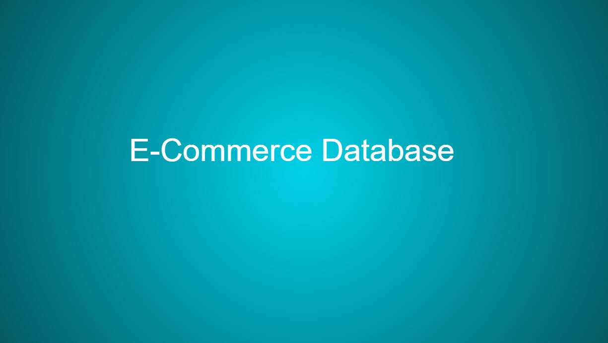

<div align="center">

# E-Commerce Application

</div>


<div align="center">

[](https://opensource.org/licenses/MIT) 

</div>

This application serves as a base for creating and populating an e-commerce backend with database information relative to your products and product categories.

## Requirements

This application will require node.js and a text editor. It will be run from the command line of your local computer.

## Table of Contents

* [Installation](#installation)
* [Credits](#credits)
* [Questions](#questions)

## Installation

copy URL

```
git clone {url}
```

From the command line, initiate applicaiton and install dependencies
```
npm init -y
npm i
```

## How to Use

The application is run from the command line. Please see walkthrough video. detailed summary;

### Video Walkthrough

- Details how to download application
- How to open inside the text editor
- How to initiate and install dependencies
- How to connect to the server
- How to create and populate database
- How to begin application

[](https://youtu.be/37vz2V0P3WE)

## Credits

[Origin 42](https://github.com/origin-42): Dave Plummer

## Questions

Direct any questions too;

- [origin-42](https://github.com/origin-42)
- d.plummer89@hotmail.com

